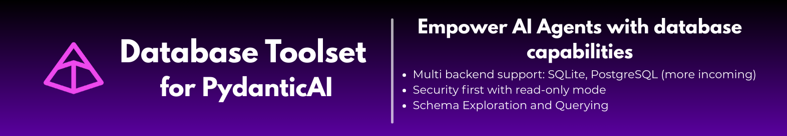

# sql-toolset-pydantic-ai



[](https://pypi.org/project/sql-toolset-pydantic-ai/)
[](https://pypi.org/project/sql-toolset-pydantic-ai/)
[](https://opensource.org/licenses/MIT)
[](https://github.com/vstorm/sql-toolset-pydantic-ai/actions)
[](https://codecov.io/gh/vstorm/sql-toolset-pydantic-ai)
[](https://github.com/astral-sh/ruff)
[](https://github.com/python/mypy)
[](https://docs.pydantic.dev/)

A powerful PydanticAI toolset designed to empower AI agents with SQL database capabilities. It provides a standardized set of tools for agents to explore schemas, query data, and understand database structures with built-in security and performance controls.

## Key Features

- **Multi-Backend Support**: Out-of-the-box support for **SQLite** (via `aiosqlite`) and **PostgreSQL** (via `asyncpg`).
- **Standardized Toolset**: Consistent interface for AI agents across different database types.
- **Security-First**: Built-in `read_only` mode to protect your data from accidental modifications.
- **Resource Management**: Configurable query timeouts and maximum row limits to prevent runaway queries.
- **Deep Exploration**: Tools for listing tables, fetching schemas, describing table structures, and explaining query plans.
- **PydanticAI Native**: Seamless integration with PydanticAI's `Agent` and `FunctionToolset` patterns.

## Installation

```bash
uv add sql-toolset-pydantic-ai
```

## Prerequisites

To run the examples and use the library with OpenAI models, you need an OpenAI API key.

1. Create a `.env` file in your project root (you can use `.env.example` as a template).
2. Add your OpenAI API key:
   ```env
   OPENAI_API_KEY=your_api_key_here
   ```

## Quickstart

Connect a PydanticAI agent to a SQLite database in just a few lines of code.

> [!WARNING]
> This example assumes you have an existing database file (e.g., `data.db`). If you don't, you can create a sample one by running the setup script in `examples/sql/sqlite/setup_db.py`.

```python
import asyncio
from pydantic_ai import Agent
from sql_toolset_pydantic_ai.sql.backends.sqlite import SQLiteDatabase
from sql_toolset_pydantic_ai.sql.toolset import create_database_toolset, SQLDatabaseDeps, SQL_SYSTEM_PROMPT
from dotenv import load_dotenv

# Load environment variables from .env
load_dotenv()

async def main():
    # 1. Initialize the database backend
    db = SQLiteDatabase("data.db")

    # 2. Setup dependencies
    deps = SQLDatabaseDeps(database=db, read_only=True)

    # 3. Create the toolset
    toolset = create_database_toolset()

    # 4. Initialize the Agent
    agent = Agent(
        "openai:gpt-4o",
        deps_type=SQLDatabaseDeps,
        toolsets=[toolset],
        system_prompt=SQL_SYSTEM_PROMPT
    )

    # 5. Run the agent
    result = await agent.run(
        "What are the top 5 most expensive products in our database?",
        deps=deps
    )
    print(result.output)

if __name__ == "__main__":
    asyncio.run(main())
```

## Documentation

Full documentation is available at [https://vstorm-co.github.io/sql-toolset-pydantic-ai/](https://vstorm-co.github.io/sql-toolset-pydantic-ai/).

To build and serve the documentation locally:

```bash
uv pip install mkdocs-material mkdocstrings[python]
mkdocs serve
```

## Examples

Detailed, runnable examples are located in the `examples/` directory:

- **SQLite**: [examples/sql/sqlite](examples/sql/sqlite/README.md) - Setup and agent usage with SQLite.
- **PostgreSQL**: [examples/sql/postgresql](examples/sql/postgresql/README.md) - Dockerized setup and agent usage with PostgreSQL.

You can run them using the provided `Makefile`:

```bash
make run-example-sqlite
make run-example-postgres
```

## Available Tools

The `create_database_toolset()` provides the following tools to the agent:

- `list_tables`: List all available tables in the database.
- `get_schema`: Get an overview of the database structure (tables, column counts, row counts).
- `describe_table`: Get detailed information about a specific table's columns, types, and constraints.
- `explain_query`: Get the execution plan for a SQL query without running it.
- `query`: Execute a SQL query and return results (respecting `max_rows` and `query_timeout`).

## Configuration

The `SQLDatabaseDeps` class allows you to control the agent's database access:

| Parameter | Type | Default | Description |
|-----------|------|---------|-------------|
| `database` | `SQLDatabaseProtocol` | **Required** | The backend instance (SQLite or Postgres). |
| `read_only` | `bool` | `True` | If True, blocks destructive queries (INSERT, UPDATE, DELETE). |
| `max_rows` | `int` | `100` | Maximum number of rows returned by the `query` tool. |
| `query_timeout` | `float` | `30.0` | Timeout in seconds for database queries. |

## Development

The project uses `uv` for dependency management and a `Makefile` for common tasks.

```bash
# Install dependencies
make install

# Run tests
make test

# Lint and format
make lint
make format

# Type checking
make typecheck
make typecheck-mypy
```

## License

This project is licensed under the MIT License - see the [LICENSE](LICENSE) file for details.
